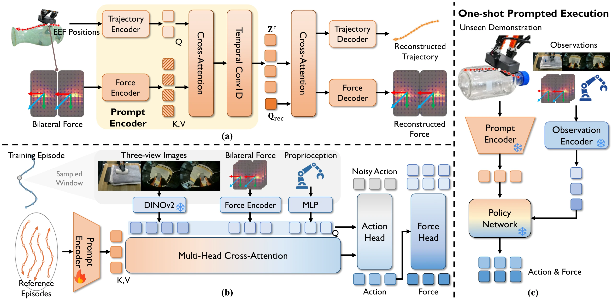

<h1 align="center">Contact Trajectory Prompting:<br>In-Context Transfer of Contact-Rich Behaviors from a Single Demonstration</h1>

<p align="center">
  Xian Nie<sup>*,1,2</sup>, Yujie Zang<sup>*,1,2,3</sup>, Yuhang Zheng<sup>*,3</sup>, Yupeng Zheng<sup>4</sup>, Songen Gu<sup>5</sup>, Wendi Chen<sup>1</sup>,<br>
  Chuan Wen<sup>1</sup>, Cewu Lu<sup>1</sup>, Wenchao Ding<sup>2</sup>, Junchi Yan<sup>1</sup>, Shuicheng Yan<sup>3</sup>
</p>

<p align="center">
  <sup>1</sup> Shanghai Jiao Tong University · <sup>2</sup> TARS Robotics · <sup>3</sup> National University of Singapore<br>
  <sup>4</sup> Institute of Automation, Chinese Academy of Sciences · <sup>5</sup> Fudan University
</p>

<p align="center">* Equal contribution</p>

Official implementation of **Contact Trajectory Prompting (CTP)** for transferring
contact-rich behaviors from a single demonstration.



CTP encodes reference force, tactile, and position sequences into continuous tokens
that condition a flow-matching policy. Training consists of contact encoder
pretraining followed by policy training with an action-conditioned force prediction
loss. At test time, a new demonstration specifies the behavior without parameter updates.

## Installation

Python 3.10+ and PyTorch with CUDA support are recommended for training.

```bash
pip install -r requirements.txt
```

## Data

Prepare Zarr datasets with the following layout and set `data.root_dir` in
[`config/pretrain.yaml`](config/pretrain.yaml) and [`config/policy.yaml`](config/policy.yaml).

```text
dataset_root/
  train/replay_buffer.zarr
  val/replay_buffer.zarr
```

Each buffer contains aligned sensor and action arrays under `data/`, with episode
boundaries in `meta/episode_ends`. Key names are configured in YAML.

| Field | Shape |
| --- | --- |
| RGB images | `[T, H, W, 3]` |
| State / absolute action | `[T, 10]` |
| Bilateral force | `[T, 12]` |
| Tactile, per hand | `[T, 35, 20, 3]` or `[T, 700, 3]` |
| `meta/episode_ends` | `[N]`, exclusive cumulative episode ends |
| `meta/behavior_id` (optional) | `[N]`, used for reference selection |

## Quick start

**1. Pretrain the contact encoder.**

```bash
python train.py --config config/pretrain.yaml
```

**2. Train the policy.** Set `model.policy.reference_encoder.checkpoint` in
`config/policy.yaml` to `outputs/pretrain/checkpoints/best.pt`.

```bash
python train.py --config config/policy.yaml
```

**3. Run open-loop evaluation.**

```bash
python tools/eval_open_loop.py \
  --checkpoint outputs/policy/checkpoints/best.pt --split val
```

<details>
<summary>Optional: multi-GPU training, image caching, and smoke check</summary>

Multi-GPU policy training:

```bash
bash scripts/train.sh --gpus 0,1 --ddp --config config/policy.yaml
```

To cache frozen image features, set `data.latent_cache_root_dir: auto` in
`config/policy.yaml`, then run before policy training:

```bash
bash scripts/precompute.sh config/policy.yaml 0
```

CPU smoke check with synthetic data:

```bash
python -m tools.smoke_test
```

</details>

## Citation

```bibtex
@misc{nie2026contacttrajectoryprompting,
  title = {Contact Trajectory Prompting: In-Context Transfer of Contact-Rich Behaviors from a Single Demonstration},
  author = {Nie, Xian and Zang, Yujie and Zheng, Yuhang and Zheng, Yupeng and Gu, Songen and Chen, Wendi and Wen, Chuan and Lu, Cewu and Ding, Wenchao and Yan, Junchi and Yan, Shuicheng},
  year = {2026}
}
```
